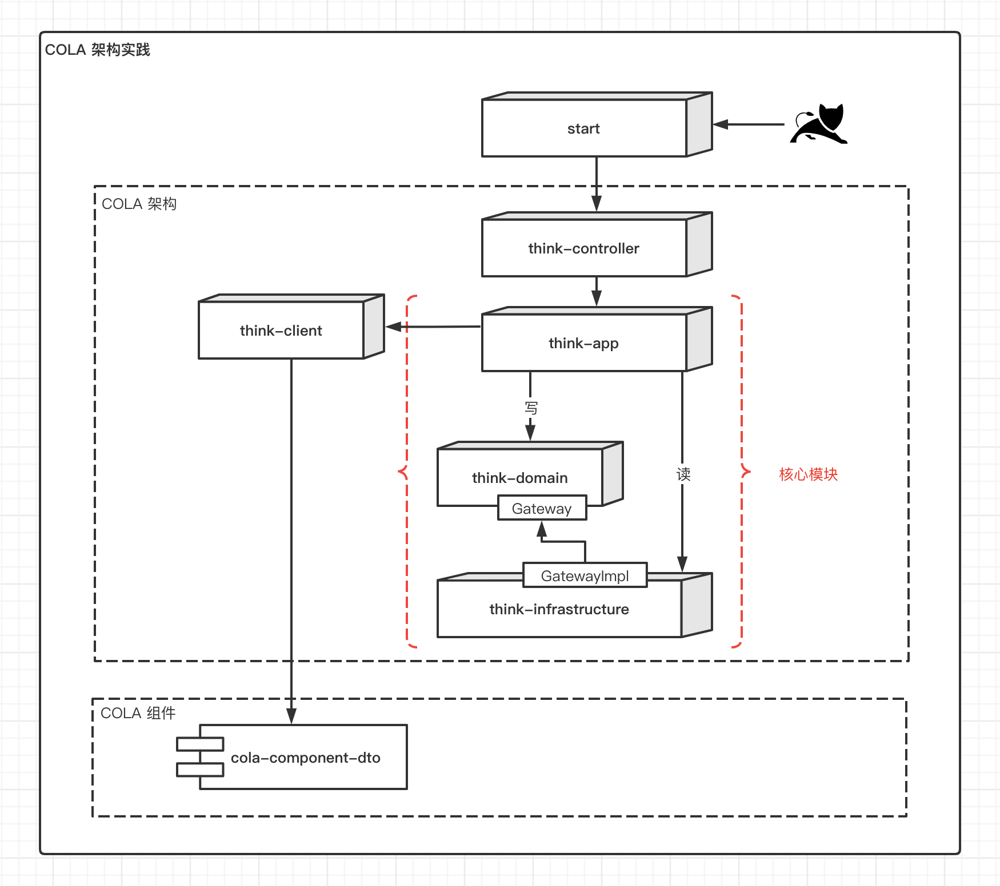
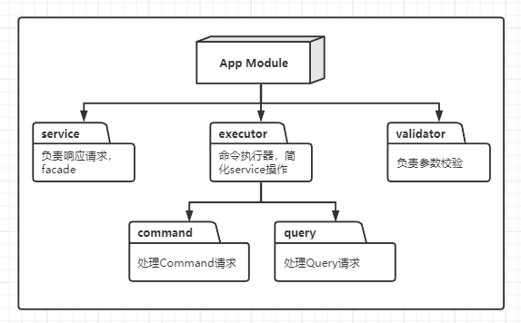
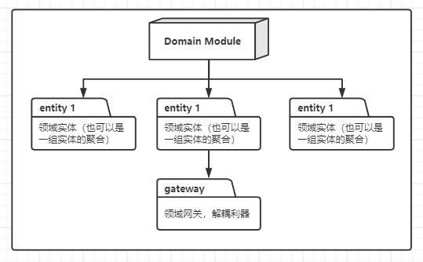
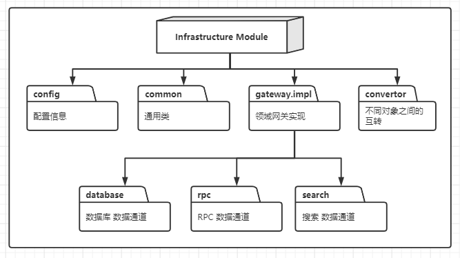

# Think

> 工程师的首要技术使命就是控制复杂度，本项目结合COLA 4.0（整洁面向对象分层架构）实现。

## 使用 Maven archetype 创建项目

```shell
mvn archetype:generate  -DgroupId=com.amos -DartifactId=think -Dversion=1.0.0-SNAPSHOT -Dpackage=com.amos.think -DarchetypeArtifactId=cola-framework-archetype-web -DarchetypeGroupId=com.alibaba.cola -DarchetypeVersion=4.0.0
```

## 项目架构图

> adapter 暂时用不到，就用 controller 代替了。



## 项目案例

用户注册、登录、修改、查询用户 && 用户列表；
数据库采用内存数据库`h2database`，也即无需准备数据库环境。 ==>  已更新为mysql


## 个人想法


## COLA 规范

> 含有部分个人习惯

|规范|用途|解释|
|---|---|---|
|xxxCO| Client Object | 客户对象，用于传输数据，等同于DTO |
|xxxCmd| Client Request | Cmd代表Command，表示一个写请求 |
|xxxQuery| Client Request | Query，表示一个读请求 |
|xxxCmdExe| Command Executor | 命令模式，每一个写请求对应一个执行器 |
|xxxQueryExe| Query Executor | 命令模式，每一个读请求对应一个执行器 |
|xxxVO| Value Object | 值对象 |
|xxxEntity| Entity | 领域实体 |
|xxxDO| Data Object | 数据对象，用于持久化 |
|xxxInterceptor| Command Interceptor | 拦截器，用于处理切面逻辑 |
|IxxxService| API Service | xxxServiceI 不太习惯，就把 I 放在前边吧 |
|xxxDomainService| Domain Service | 需要多个领域对象协作时，使用DomainService |
|xxxValidator| Validator | 校验器，用于校验的类 |
|xxxAssembler| Assembler | 组装器，组装外部服务调用参数 |
|xxxConvertor| Convertor | 转化器，实现不同层级对象互转（[小彩蛋](./doc/README.md#Convertor)） |

### 方法名约定

### 模块规范

> 没有银弹，仅做参考，按需取舍吧







## 参考
